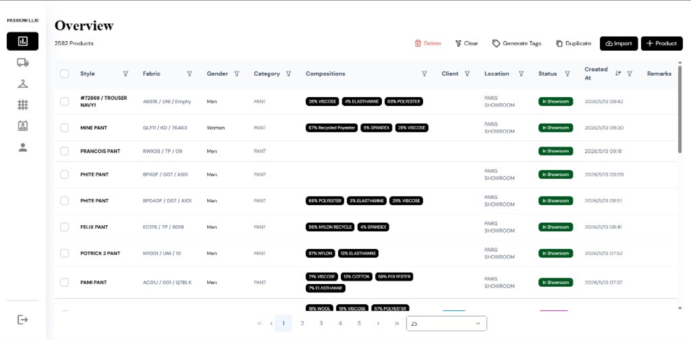

## Overview

A shared platform for fashion manufacturer inventory and desk operations: a React (TypeScript) web app for office workflows and a Flutter companion app for floor and logistics tasks.

## Highlights

- JWT authentication and role-aware operational workflows
- Excel import/export for bulk inventory and desk data
- FedEx logistic API integration
- QR-driven mobile flows that share the same backend as the web app
- AWS infrastructure: EC2, RDS, S3, and CloudFront
- App Store private listing for the mobile companion

## Role

Built and maintained the React web frontend alongside the Flutter mobile app, and helped configure the AWS deployment path used in production.

## Media

Add screenshots or a walkthrough by setting `heroImage`, `gallery`, and/or `videoUrl` in this file’s frontmatter. You can also embed images inline:

```md

```

Place image files next to this markdown (e.g. `src/content/projects/images/`).
